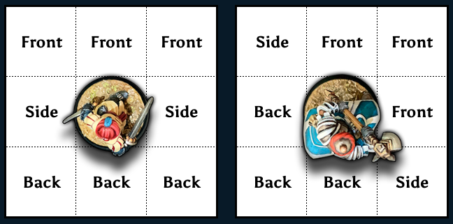

# Chapter 8: Combat

Combat is an important feature of roleplaying games. Violent confrontation has ever been a way of settling problems, from vengeance-driven fights between nemeses, to the clash of armies in times of war. Nevertheless, combat need not be a savage battle to the death. Some combat encounters can be swashbuckling duels which end without injury, or perhaps light-hearted bar room brawls. _Classic Fantasy Imperative_ uses several terms to explain the core elements of combat. These are explained in the following sections, but in overview, these are:

- **Combat Skill:** The skill of wielding a group of weapons learned as part of a culture or profession.
- **Combat Rounds:** Bookkeeping time segments of five seconds each.
- **Combat Actions:** Possible acts a character can perform during a Round by the expenditure of an Action Point.
- **Weapon Size:** How difficult it is to Parry a particular weapon.
- **Engagement:** When combatants can hit or be hit directly by an opponent, depending on circumstances.
- **Special Effects:** Combat maneuvers which can be performed if one combatant gains the upper hand.

---
## Combat Skill

Combat skill represents a 'package' of multiple weapons related by Class, which avoids the necessity of learning each individual weapon separately.

The most important aspect of Combat Skill is that the character learns how to use each weapon in the skill, both singly and in combination so that they might be interchanged, as necessary. Combat training does not focus merely on using a specific weapon or weapons under best conditions, but also covers what to do when placed at a severe disadvantage. Such cross-training is a primary part of preparing a combatant for the unpredictable events of the battlefield, where weapon breakage or becoming disarmed is always a potential possibility.

All character Classes offer training in their Combat Skill. This may be a few weapons as in the case of the mage or be all encompassing and include all weapons and shields, as in the fighter.

---
## Running Combat

To emphasize its visceral nature, combat is tracked on a blow-by-blow basis. To ease bookkeeping, fights are broken down into Combat Rounds of five seconds each. During this period combatants may make hand-to-hand attacks or defend against them, maneuver into and out of combat, fire or throw a Ranged weapon, and so on. Similar to real life, most combat engagements – once joined – are concluded in a matter of seconds rather than minutes. In game terms this means several Combat Rounds (usually three or less), unless participants withdraw to perhaps reset Initiative, reassess their tactical situation, or simply to grab a momentary rest before re-engaging. Only fights between well matched foes or sequences of opponents tend to last longer.

Combat Rounds use several important terms:

- **Initiative:** The order of Turns indicates who acts when during  a Combat Round. The Games Master counts down through Initiative values from the highest to the lowest, so that each participant has a chance to take their Turn when their number is reached.
- **Turns:** During each 5 second Combat Round, each participant has an opportunity to take one or more Turns, dependent on the number of Action Points they possess, and how they use them. Upon their Turn, participants perform one Combat Action, which comprises of a declaration, possible movement, any necessary dice rolls (including Reactions), and the resolution of the Action. If any participant has Action Points remaining, the players may each take another Turn in Initiative order. Once no Action Points remain, or any remaining are being held back for Reactions, play proceeds to the next Combat Round.

Each term is described in more detail, below.

### Initiative

Initiative determines participants' order of Actions in a Combat Round. It is rolled at the start of a fight and determines when each character acts. Unless something occurs to change the situation, such as certain Combat Actions or Special Effects, Initiative remains in play until it is forced to be re-rolled.

Initiative is calculated by each participant rolling 1d10 and adding their Initiative Modifier. Whoever gained the highest result acts first, followed by the second highest and so on. When two or more participants tie scores, the one with the higher DEX will act first. If this still results in a tie, have each roll a die with the higher roll going before the other.

### Actions in Combat

Once Initiative has been determined, the participants have the potential to perform several Combat Actions during each Combat Round. All beginning characters get 2 Action Points per Round, with more gained as they go up in Rank, but when they can act is limited to whether the Action is Proactive or Reactive. Proactive Actions can only be attempted on the character's own Turn; that is to say, during his Initiative. Proactive Actions are those in which the character is the instigator, such as making an attack with a weapon.

Reactive Actions are those taken by a character to counter or resist an act made against them. Only one reaction attempt is permitted for each threat, an example would be trying to Parry an attack.

Unused Action Points do not carry over from one Round to the next.

---
## Combat Actions

Combat Actions are those acts which can be performed during battle. Drawing a weapon, casting a spell, or diving clear from an attack are all examples of Combat Actions. Most are concerned with elements of combat itself, but some relate to activities outside the realm of spells and weapons.

As previously mentioned, how often a character can act per Round is limited by their available Action Points. These are spent over the course of each Combat Round to perform various Combat Actions. Once a combatant's Action Points are expended, they may no longer act for the remainder of that Round and must wait until their points reset at the beginning of the next.

Unless otherwise specified any Combat Action (save for "Free" Actions) costs one Action Point. Thus, combatants need to carefully consider how and when they use their Action Points. They may act as aggressively or defensively as they wish, dynamically reacting to the evolving circumstance of the combat.

---
### Proactive Actions

The following are activities a character can attempt on his Turn by spending an Action Point. Note that some Actions such as spell casting or reloading may take several Turns to complete; each Turn costing its own Action Point.

#### Attack

The character can attempt to strike with a hand-to-hand weapon or use a Ranged weapon.

#### Brace

The character braces by taking a firm stance and leaning into the direction of a forthcoming attack. For the purposes of resisting Knockback or Leaping Attacks, the character's SIZ is treated as 50% bigger. Against the Bash Special Effect, SIZ is doubled.

#### Cast Magic

The character can attempt to cast a spell, invoke certain racial or class abilities, or produce some other magical effect. Complex magics may require several Actions to complete the casting. Once concluded, the magic can be released at any moment up until the caster's next Turn – at which point it can be held for later effect, but this requires the [Hold Magic](0008_Combat.md?id=hold-magic) Action (see below) to maintain it in preparation for later release.

#### Change Range

The character can attempt to close in on or retreat from an opponent.

#### Charge

The Charge Action allows a character to move into engagement range at running or sprinting speed, using the momentum of the charge to make a more forceful melee attack. [Charging](0008_Combat.md?id=charging) is covered in more detail below.

#### Delay

The character conserves one or more Actions in order to perform Reactive Actions later, such as Interrupt or Parry. The Action Point costs of delaying is covered by whatever acts are finally performed. If the delayed Actions are not taken before the character's Turn in the next Round, then the character is considered to have Passed and the Action Points are lost.

#### Dither

The default option unless another Action is chosen, the character simply wastes his turn doing nothing useful.

#### Hold Magic

Once casting is complete, the character may hold a spell in temporary check, awaiting the best moment to release it. The magic may be held back for as long as the character continues to take this Action on subsequent Turns, but this allows free use of the Counter Spell reaction by an enemy if pertinent to the spell. The actual skill roll to cast the held spell is not made until it is cast.

#### Hustle

Provided they are not Engaged with an opponent, the character can move at Run (up to 3x Base Movement Rate) or Sprint (up to 5x the Movement Rate). However, one cannot perform or have performed any other Proactive Actions during this turn, including other movement.

#### Mount

The character can mount or dismount a riding beast or vehicle. Particularly large mounts may require several Turns to complete.

#### Move

Provided one is not Engaged with an opponent; the character can move up to Base Movement Rate. If this brings them into contact with an enemy, they may make a melee attack without expending a further Action to do so, either way, the character is then considered Engaged. Unlike the Hustle Action, the Move Action may be taken multiple times during a Combat Round.

#### Outmaneuver

The character can engage multiple opponents in a group Opposed Roll of Evade skills. Those who fail to beat his roll cannot attack him in that Combat Round. See the section on [Outmaneuvering](0008_Combat.md?id=outmaneuvering).

#### Ready

The character may retrieve, draw, sheath, withdraw, or reload a weapon or other object. Retrieving a nearby dropped object requires 2 Actions: one to move and reach down for the object and a second to return to a readied stance. Some missile weapons require several Actions to reload.

#### Regain Footing

If unengaged with an opponent, the character can automatically regain his footing from being tripped or knocked down. If Engaged, the character must win an Opposed Test of Brawn or Athletics with the opponent before standing.

#### Struggle

If the character is the victim of certain types of attack or Special Effects, they may attempt to extract themself from the situation. For example, breaking free from a Grapple.

#### Take Cover

Take Cover is a Proactive Action that allows the character to duck behind available cover in their immediate vicinity, thereby gaining some degree of protection against ranged attacks and spells. Unlike Evade it does not leave the user prone but does rely on some form of cover being available; for example, ducking back around a corner in a corridor or crouching down behind a table in a tavern.

---
### Reactive Actions

This list specifies reactions that can be used at any time during the Combat Round as a response to an imminent threat. As in the previous list, a reaction costs an Action Point to perform.

#### Counter Spell

The character can attempt to dismiss or counter an incoming spell. This assumes the countering magic has a Casting Time of one Turn, otherwise it must be prepared in advance and temporarily withheld using the Hold Magic Action. Successfully intercepting magic in this manner is assumed to negate the entire spell, even those with multiple targets or areas of effect.

#### Evade

The character can use their Evade skill in an attempt to dive clear of threats such as incoming missiles or a charging attack. This leaves the character prone unless mitigated by an Ability or special circumstance. Thus, the character's next turn is usually spent taking the Regain Footing Action to stand again. When Evading breath weapons or other Area of Effect attacks, if within 10 feet of the edge of the effect, a successful Evade will allow you to dive to safety and take no damage instead of half. This will still leave you prone, regardless of any special consequence that can negate that penalty. See [Evading](0008_Combat.md?id=evading) for more detail.

#### Interrupt

Delaying characters only. This Reactive Action halts an opponent's Turn at any point to take a delayed Turn Action. Assuming no change in the tactical situation, the opponent continues the Turn after the character's is completed. If unable to still achieve the original declaration, the opponent's Action Point is wasted. An interrupt can also be used to perform an attack-of-opportunity against anyone passing close by the delaying character and within weapon's reach.

#### Parry

The character can attempt to defend against an incoming attack using a combination of Parrying, leaning, ducking, and sidestepping footwork to minimize the blow.

---
### Free Actions

Free Actions (listed below) can be performed at any time during the Combat Round and cost no Action Points to perform.

#### Assess Situation

If unengaged, a character can make a Perception roll at no Action Point cost. A Success reveals any relevant changes in the tactical situation (such as spotting a foe beginning a charge). Assessing while Running results in a Hard Perception roll, Sprinting is Formidable.

#### Drop Item

Dropping an item is a Free Action.

#### Signal

If unengaged, gesturing or signaling to one or more participants (if they can perceive the sign) is a Free Action.

#### Speak

A character can speak at any time during combat, but what is said should be limited to short phrases which can be uttered in five seconds or less; for example, 'Look out behind you!' or 'Damn you to hell!'

#### Use Luck Point

Using a Luck Point – to re-roll a particular result for example – is a Free Action.

#### Ward Location

The character guards a particular Hit Location from being hit by dedicating one of his weapons to passively block the area. Any blow which lands on that location has its damage automatically downgraded as per normal for a Parrying weapon of its Size. The cover continues until the dedicated weapon is used to attack or actively Parry. Establishing or changing the Hit Location covered must be performed prior to an opponent rolling to attack the character. Due to their design, shields can cover multiple areas.

For further explanation see [Passive Blocking](0008_Combat.md?id=passive-blocking).

---
## Movement

The following rules govern engagement in combat:

- Movement is performed by either the Move, Hustle, or Charge Action.
- The Move Action allows the character to move a distance equal to their Base Movement Rate.
- The Hustle Action allows a character to Run a distance equal to 3x Movement Rate, or Sprint at 5x Movement Rate.
- Movement can only be performed by unengaged characters (save for special cases such as Outmaneuvering).
- Except in certain cases (such as Charging), all significant movement ceases once a character enters the engagement range of the intended opponent.
- Except in certain cases (such as Charging through Contact), moving into the opponent's engagement zone places each combatant in engagement with the other.
- Once Engaged, characters cannot move away from an opponent unless first Withdrawing from close combat.
- Attempting to move past an unengaged foe who is using the Delay Action, permits (as a specific exception) that opponent to strike at moving characters as they pass by or block a character's progress, prompting close combat on the following Turn or Round.

### Situational Movement Rates

These movement rates are situational and are not always an option. Many are detailed elsewhere but are included here for convenience. Most of these situational rates may be used in addition to a normal Movement Rate under set restrictions. Such information is detailed in the specific descriptions below.

#### Climb

A character that moves adjacent to or starts the Turn next to a climbable surface or object may climb at a rate equal to the Base Movement Rate. The character cannot have moved faster than a Walk and must have movement remaining, with the distance climbed being reduced by any movement already used. Worn armor hinders climbers, with each location covered by light armor counting as 1 additional 'Thing' carried, and each location covered by heavy armor counting as 2 additional 'Things' carried.

#### Crawl

A character that begins the Turn prone may crawl at a maximum rate of 5 feet per Turn in place of a normal Move. Creatures that naturally crawl as their normal mode of movement instead use the rules for Walk, Run, and Sprint set forth above.

#### Jump

A character that moves adjacent to or starts the Turn next to a jumpable obstacle may attempt to leap over it. The character may be moving at any rate up to the point of the leap. A successful Athletics roll allows one to jump up to twice one's own height horizontally or up to half one's own height vertically (if the character has at least a 15-foot run-up available). If jumping from a standing position, then these distances are halved. Reduce the jump distance in feet by half the total 'Things' carried. Worn armor hinders jumpers, with each location covered by light armor counting as 1 'Thing' in the before mentioned calculation, and heavy armor counts as 2 'Things.'

See the [Athletics](0005_Skills.md?id=athletics-strdex) skill description for more information.

On a Critical Success, the character adds a further 5 feet to his total distance and remains upright on landing.

A Fumble indicates the character has landed awkwardly. He must immediately make an Endurance roll. If the Endurance roll is a Success, 1 point of damage is sustained to one leg. If the Endurance test Fails, then 1d4 points of damage is inflicted instead.

#### Swim

A character that moves adjacent to or starts the Turn next to a body of water may swim at a rate equal to the Base Movement Rate, minus any movement already used. See the [Swim](0005_Skills.md?id=swim-strcon) skill description for more information. Under normal conditions a character's maximum swimming speed per Round is equal to their Movement Rate, -1 for each 'Thing' carried more than the character's STR. Worn armor hinders swimmers, with each location covered by light armor counting as 1 additional 'Thing' carried, and each location covered by heavy armor counting as 2 additional 'Things' carried. If total ENC reduces swim distance to 0 or less, the character automatically begins drowning (refer to the rules on  [Asphyxiation](0007_Game_System.md?id=asphyxiation)).

### Miniatures and Movement

Miniatures combat assumes the use of battle mats with a 1-inch square grid.

#### Scale

These rules work best where 1 inch is equal to either 5 feet or 10 feet.

#### Facing

A character's facing is one of the most important considerations on the battlefield. Leaving one side or your back open to attack is the fastest way to meet an untimely death. What follows are two facing diagrams. At the end of movement, a figure must be facing one of the sides of the square occupied, or optionally, into a diagonal, as seen below.

**Attacking** may be performed into any of the character's front or side squares.

**Evading** is always at Standard Difficulty against any attack except those from a back square, which is Formidable and requires a successful Perception roll to even know the attack is coming.

### Effects of Terrain on Movement

Battlefields will usually have terrain of some type that hinders movement, represented as either Obstacles or Difficult Terrain.

Obstacles can be anything from huge trees, walls, high fences, doors, pits, and so on. An Obstacle completely blocks movement, requiring opponents to circumvent it; however, some creatures, like ghosts or those that fly, are unaffected by Obstacles. If an object doesn't completely block a square, like a chair, small tree, or bush, it is treated as Difficult Terrain.

Difficult terrain costs twice the normal movement to enter. Thus, moving into an area of Difficult Terrain in a 5-foot square would count as 10 feet of movement. A slow creature hindered by Difficult Terrain can always move a minimum of 5 feet. Some examples of Difficult Terrain would be shallow pools of water, rubble, low fences, bushes, tall grass/weeds, and dead bodies. Some creatures, like ghosts or those that fly are unaffected by Difficult Terrain. Passing through Difficult Terrain at any rate faster than the Base Movement Rate requires a Formidable Athletics or a Standard Acrobatics roll to avoid stumbling and falling.

---
## How Combat Works

Fighting in _Classic Fantasy Imperative_ is resolved with each attack or Parry representing a single stab, swing, spell cast, or shot of a weapon. Any offensive Action permits the chance to be resisted by a reaction. Thus, even if a character manages to strike an opponent, the foe is permitted their own roll to see if they can Parry the blow before it lands. The same philosophy is used whether the attacks are missile weapons against targets diving for cover or trying to break free from the iron grasp of a giant octopus.

### Attacks and Parries

Close combat is handled in the following step-by-step manner:

1. On his turn the attacker spends an Action Point, rolls against his Combat Skill, and notes the result.
2. If desired, the defender spends an Action Point, rolls against his Combat Skill, and notes the result.
3. The success level of the results are compared as per [Differential Rolls](0005_Skills.md?id=differential-rolls).
4. Any difference grants the successful combatant with the superior roll one or more Special Effects.
5. If the attacker achieved a Success or Critical, they may roll weapon damage and apply their Damage Modifier (if any). If applicable, a Hit Location is determined for the blow.
6. If the defender achieved a Success or Critical, reduce any damage inflicted according to the comparative sizes of the weapons involved.
7. Reduce any remaining damage by the Armor Points of natural or worn protection.

Note that any Special Effects generated by the exchange are independent of whether damage is inflicted. It is quite possible for a defender to gain the higher success level, yet still suffer injury.

### Weapon Size

Every weapon in _Classic Fantasy Imperative_ possesses several different attributes from the damage it deals to how many hands are required to wield it. Size is a combination of a weapon's mass, leverage, and stability, and is used to determine the weapon's ability to impose and Parry damage. Size categories are _Small, Medium, Large, Huge,_ and _Enormous_. The unarmed attacks of creatures are assigned similar categories according to their physical characteristics.

### Damage Reduction

If a defender succeeds in Parrying, then they can reduce an attacker's damage, if any, according to the comparative Size of the weapons used.

- Parrying an attack with a weapon or shield of _equal or greater_ Size deflects _all_ damage.
- Parrying with a weapon or shield of _one Size less_ only deflects _half_ damage.
- Parrying with a weapon or shield _two or more Sizes less_ fails to deflect _any_ damage.

For example, Parrying a great axe (Huge) with a kite shield (also Huge) would block all damage; Parrying it with a Longsword (Large) would halve the damage, and Parrying it with a shortsword (Medium) would stop no damage at all.

### Armor

Any damage which penetrates the defender's Parry is further reduced by the Armor Points of any natural protection (such as scales or a shell) or worn armor they possess. If the defender has both, then the two stack together to reduce damage.

Due to its mass and restriction to movement, the highest Armor Point value of armor _worn_ by a character acts as a penalty to their Initiative roll.

### Parrying a Missed Attack

If the attacker misses his initial attack roll, the defender still has the option to spend an Action Point to Parry. Although it may seem disingenuous to Parry an attack which will miss anyway, a skilled defender can use this to his advantage to gain one or more Special Effects, potentially weakening or incapacitating a foe and preserving their next turn for some other Action.

### Unable or Unwilling to Parry

In a situation where a defender is unable to Parry due to having no Action Points remaining, or, confident in his ability to weather the blow, elects not to Parry, they are treated as having automatically rolled a Failure. This has the consequence of granting a successful attacker one or more Special Effects.

### Unsuccessful Rolls and Fumbles

If both combatants Fail their rolls, or the defender decides not to take advantage of a missed attack, then the Attack / Parry sequence ends, and combat continues on to the participant with the next highest Initiative.

---
## Special Effects

Fighting is far more than simply injuring or killing an opponent. Combative arts teach many methods of _defeating_ a foe, perhaps rendering them helpless or forcing them into situations where they must capitulate, without necessarily needing to cause them harm. Special Effects represent these techniques and control how they occur in play.

Whenever opponents engage in a Differential Roll of their respective fighting skills, any resulting difference in success levels indicates an opportunity for Special Effects to occur. This reflects one combatant maneuvering his opponent into a disadvantageous situation which can be exploited using a cunning trick or tactic.

The number of Special Effects received depends on the difference between the Levels of Success, as illustrated on the [Differential Roll Results table](0005_Skills.md?id=differential-roll-results-table).

If any Special Effects are won during an exchange, they must be selected before Damage and Hit Location, if any, are rolled. In cases where the recipient is badly wounded in addition to receiving a Special Effect, Endurance rolls are resolved after the application of the effect.

Special Effects cover a diverse range of situations and techniques. Some are designed specifically for attacks, while others are intended for defense, and a few are adaptable for either circumstance. Certain Special Effects can also be limited to specific weapon types or specific dice rolls, requiring a Critical or Fumble result on their skill check for instance.

When two or more Special Effects are gained, the combatant may freely mix and match which ones are selected, providing the prerequisite conditions for each one is met. Some effects can be stacked. For example, an attacker who rolls a Critical Success and wins two Special Effects could choose Maximize Damage twice rather than choosing two separate offensive maneuvers.

### Special Effects Table

| Special Effect | Offensive | Defensive | Special Weapon Type | Specific Roll | Stackable |
| :-- | :-: | :-: | :-- | :-: | :-: |
| [Accidental Injury](0008_Combat.md?id=accidental-injury) | | X | | Attacker Fumbles | |
| [Arise](0008_Combat.md?id=arise) | | X | | | |
| [Bash](0008_Combat.md?id=bash) | X | | Shields or Bludgeoning | | |
| [Bleed](0008_Combat.md?id=bleed) | X | | Cutting Weapons | | |
| [Blind Opponent](0008_Combat.md?id=blind-opponent) | | X | | Defender Criticals | |
| [Bypass Armor](0008_Combat.md?id=bypass-armor) | X | | | Attacker Criticals | X |
| [Choose Location](0008_Combat.md?id=choose-location) | X | | | See Description | |
| [Circumvent Parry](0008_Combat.md?id=circumvent-parry) | X | | | Attacker Criticals | |
| [Damage Weapon](0008_Combat.md?id=damage-weapon) | X | X | | | |
| [Disarm Opponent](0008_Combat.md?id=disarm-opponent) | X | X | | | |
| [Enhance Parry](0008_Combat.md?id=enhance-parry) | | X | | Defender Criticals | |
| [Entangle](0008_Combat.md?id=entangle) | X | X | Entangling Weapons | | |
| [Force Failure](0008_Combat.md?id=force-failure) | X | X | | Opponent Fumbles | |
| [Grip](0008_Combat.md?id=grip) | X | | Unarmed | | |
| [Impale](0008_Combat.md?id=impale) | X | | Impaling Weapons | | |
| [Sharpshooter](0008_Combat.md?id=sharpshooter) | X | | Ranged Weapons | | |
| [Maximize Damage](0008_Combat.md?id=maximize-damage) | X | | | Attacker Criticals | X |
| [Prepare Counter](0008_Combat.md?id=prepare-counter) | | X | | | X |
| [Rapid Reload](0008_Combat.md?id=rapid-reload) | X | | | | X |
| [Scar Foe](0008_Combat.md?id=scar-foe) | X | X | | | |
| [Select Target](0008_Combat.md?id=select-target) | | X | | Attacker Fumbles | |
| [Slip Free](0008_Combat.md?id=slip-free) | | X | | Defender Criticals | |
| [Stun Location](0008_Combat.md?id=stun-location) | X | | Bludgeoning Weapons | | |
| [Sunder](0008_Combat.md?id=sunder) | X | | Two Handed Weapons | | |
| [Trip Opponent](0008_Combat.md?id=trip-opponent) | X | X | | | |
| [Withdraw](0008_Combat.md?id=withdraw) | | X | | | |
### Special Effect Descriptions

#### Accidental Injury

The defender deflects or twists an opponent's attack in such a way that the attacker fumbles, injuring themself. The attacker must roll damage against himself in a random Hit Location using the weapon used to strike. If unarmed, the attacker tears or breaks something internal, the damage roll ignoring any armor.

#### Arise

Allows the defender to use a momentary opening to roll back up to their feet.

#### Bash

The attacker deliberately bashes the opponent off balance. How far the defender totters back or sideward depends on the weapon being used. Shields knock an opponent back 5 feet per for every 3 points of damage rolled (prior to any subtractions due to armor, parries, and so forth), whereas bludgeoning weapons knock back 5 feet per for every 5 points. Bashing works only on creatures up to twice the attacker's SIZ. If the recipient is forced backward into an obstacle, then they must make an Acrobatics skill roll or Athletics roll at Hard difficulty to avoid falling or tripping over.

#### Bleed

The attack cuts open a major blood vessel. If the blow overcomes Armor Points and injures the target, the defender must make an Opposed Roll of Endurance against the original attack roll. If the defender Fails, then they begin to bleed profusely. At the start of each Combat Round, the recipient loses one level of Fatigue, until they collapse and possibly die. Bleeding wounds can be staunched by passing a First Aid skill roll, but the recipient can no longer perform any strenuous or violent action without re-opening the wound. See [Blood Loss](0007_Game_System.md?id=blood-loss).

#### Blind Opponent

On a Critical the defender briefly blinds his opponent by throwing sand, reflecting sunlight off his shield, or some other tactic that briefly interferes with the attacker's vision. The attacker must make an Opposed Roll of his Evade skill (or Weapon skill if using a shield) against the defender's original Parry roll. If the attacker Fails, they suffer a situational modifier of Hard or Formidable for the next 1d3 Turns, depending on the method of blinding.

#### Bypass Armor

On a Critical the attacker finds a gap in the defender's natural or worn armor. If the defender is wearing armor above natural protection, then the attacker must decide which of the two is bypassed. This effect can be stacked to bypass both. For the purpose of this effect, physical protection gained from magic is considered as being worn armor.

#### Choose Location

When using hand-to-hand melee weapons the attacker may freely select the location where the blow lands, as long as that location is normally within reach. If using Ranged weapons Choose Location is a Critical Success only, unless the target is within Close Range and is either stationary or unaware of the attacker.

#### Circumvent Parry

On a Critical the attacker may completely bypass an otherwise successful Parry.

#### Damage Weapon

Permits the character to damage his opponent's weapon as part of an attack or Parry. If attacking, the character aims specifically at the defender's Parrying weapon and applies his damage roll to it, rather than the wielder. The targeted weapon uses its own Armor Points for resisting the damage. If reduced to zero Hit Points the weapon breaks.

#### Disarm Opponent

The character knocks, yanks, or twists the opponent's weapon out of his hand. The opponent must make an Opposed Roll of his Combat Style against the character's original roll. If the recipient of the disarm loses, his weapon is flung a distance equal to the roll of the disarmer's Damage Modifier x3 feet. If there is no Damage Modifier, then the weapon drops at the disarmed person's feet. The comparative size of the weapons affects the roll. Each step that the disarming character's weapon is larger increases the difficulty of the opponent's roll by one grade. Conversely, each step the disarming character's weapon is smaller makes the difficulty one grade easier. Disarming works only on creatures of up to twice the attacker's STR.

#### Enhance Parry

On a Critical the defender manages to deflect the entire force of an attack, no matter the Size of his weapon.

#### Entangle

Allows a character wielding an entangling weapon, such as a whip or net, to immobilize the location struck. An entangled arm cannot use whatever it is holding; a snared leg prevents the target from moving; while an enmeshed head, chest, or abdomen makes all skill rolls one grade harder. On his following turn, the wielder may spend an Action Point to make an automatic Trip Opponent attempt. An entangled victim can attempt to free himself on his turn by either attempting an Opposed Roll using Brawn to yank free, or win a Special Effect and select Damage Weapon, Disarm Opponent, or Slip Free.

#### Force Failure

Used when an opponent Fumbles, the character can combine Force Failure with any other Special Effect which requires an Opposed Roll to work. Force Failure causes the opponent to Fail his resistance roll by default – thereby automatically be disarmed, tripped, and so forth.

#### Grip

Provided the opponent is within the attacker's Unarmed Combat reach, they may use an empty hand (or similar limb capable of gripping) to hold onto the opponent, preventing them from being able to disengage from combat. The opponent may attempt to break free on his turn, requiring an Opposed Roll of either Brawn or Unarmed against whichever of the two skills the gripper prefers.

#### Impale

Roll weapon damage twice, with the attacker choosing which of the two results to use for the attack. Assuming the weapon is a melee weapon, if armor is penetrated and causes a wound, the attacker has the option of leaving the weapon in the wound or yanking it free on their next turn. Leaving the weapon in the wound inflicts a Difficulty Grade on the victim's future skill attempts. The severity of the penalty depends on the size of both the creature and the weapon impaling it, as listed on the Impale Effects Table below. For simplicity's sake, further impalements with the same sized weapon inflict no additional penalties. To withdraw an impaled weapon during melee requires use of the Ready Weapon Combat Action. The wielder must pass an unopposed Brawn roll (or win an Opposed Brawn roll if the opponent resists). Success pulls the weapon free, causing further injury to the same location equal to half the normal damage roll for that weapon, but without any Damage Modifier. Failure implies that the weapon remains stuck in the wound with no further effect, although the wielder may try again on their next turn. Specifically barbed weapons (such as harpoons) inflict normal damage. Armor does not reduce withdrawal damage. While it remains impaled, the attacker cannot use his impaling weapon for Parrying.

##### Impale Effects Table

| Creature SIZ | Small Weapons | Medium Weapons | Large Weapons | Huge Weapons | Enormous Weapons |
| :-- | :-- | :-- | :-- | :-- | :-- |
| 1-10 | Formidable | Herculean | Incapacitated | Incapacitated | Incapacitated |
| 11-20 | Hard | Formidable | Herculean | Incapacitated | Incapacitated |
| 21-30 | No Effect | Hard | Formidable | Herculean | Incapacitated |
| 31-40 | No Effect | No Effect | Hard | Formidable | Herculean |
| 41-50 | No Effect | No Effect | No Effect | Hard | Formidable |
| Each +10 | Follow table progression |

#### Sharpshooter

Permits the shooter to move the Hit Location struck by his shot by one step, to an immediately adjoining body area. Physiology has an effect on what can be re-targeted and common sense should be applied. Thus, using this Special Effect on a humanoid would permit an attacker who rolled a leg shot, to move it up to the abdomen instead. Conversely shooting a griffin in the chest would permit selection of the forelegs, wings, or head.

#### Maximize Damage

On a Critical the character may substitute one of his weapon's damage dice for its full value. For example, a Hand Axe which normally does 1d6 damage would instead be treated as a 6, whereas a great club with 2d6 damage would instead inflict 1d6+6 damage. This Special Effect may be stacked. Although it can also be used for natural weapons, Maximize Damage does not affect the Damage Modifier of the attacker, which must be rolled normally.

#### Prepare Counter

The defender reads the patterns of his foe and prepares a counter against a specific Special Effect (which should be noted down in secret). If his opponent attempts to inflict the chosen Special Effect upon him during the fight, the defender instantly substitutes the attacker's effect with one of his own, which succeeds automatically.

#### Rapid Reload

When using a Ranged weapon, the attacker reduces the reload time for the next shot by one. This effect can be stacked.

#### Scar Foe

The combatant inflicts his opponent with a scar that will be the talk of all for the rest of his or her life - such as an almost-severed-throat, or the letter 'Z' artfully inscribed across the chest.

#### Select Target

When an attacker Fumbles, the defender may maneuver or deflect the blow in such a way that it hits an adjacent bystander instead. This requires that the new target is within reach of the attacker's close combat weapon, or in the case of a ranged attack, is standing along the line of fire. The new victim is taken completely by surprise by the unexpected accident and has no chance to avoid the attack which automatically hits. In compensation, however, they suffer no Special Effect.

#### Slip Free

On a Critical the defender can automatically escape being Entangled, Gripped, or Pinned.

#### Stun Location

The attacker can use a bludgeoning weapon to temporarily stun the body part struck. If the blow overcomes Armor Points and injures the target, the defender must make an Opposed Roll of Endurance vs. the original attack roll. If the defender Fails, then the Hit Location is Incapacitated for a number of Turns equal to the damage inflicted. A blow to the torso causes the defender to stagger winded, only able to defend. A head shot renders the foe briefly insensible and unable to act.

#### Sunder

The attacker may use a suitable weapon, such as an axe, to damage the armor or natural protection of an opponent. Any weapon damage, after reductions for Parrying or magic, is applied against the Armor Point value of the protection. Surplus damage over its Armor Points is then used to reduce the AP value of that armor(ed) location – ripping straps, bursting rings, creasing plates, or tearing away the hide, scales, or chitin of monsters. If any damage remains after the protection has been reduced to zero AP, it carries over onto the Hit Points of the location struck.

#### Trip Opponent

The character attempts to overbalance or throw his opponent to the ground. The opponent must make an Opposed Roll of his Brawn, Evade, or Acrobatics against the character's original roll. If the target Fails, they fall prone. Quadruped opponents (or creatures with even more legs) may substitute their Athletics skill for Evade and treat the roll as one Difficulty Grade easier.

#### Withdraw

The defender may automatically withdraw out of reach, breaking off engagement with that particular opponent.

---
## Close Combat

Close combat is hand-to-hand fighting in its classic sense when combatants strike each other with wielded or natural weapons. The following guidelines offer ways to make close combat more interesting and help to further explain some concepts hinted at earlier in this chapter.

### Situational Modifiers

Situational modifiers may be applied when fighting in particular conditions, or as the result of a Special Effect. For example, fighting in the dark might incur a Difficulty Grade of Herculean. Unless stated otherwise, modifiers are decided by the Games Master. Where two or more situations are pertinent to the character, use the most severe.

Some modifiers are circumstance dependent, but rather than applying a Difficulty Grade the Combat Skill is limited by a relevant skill. For example, fighting from the back of a horse would cap the combatant's Combat Skill by their Ride skill, while fighting in water might cap it to the value of the character's Swim.

##### Close Combat Situational Modifiers

| Situation | Difficulty Grade |
| --- | --- |
| Attacking a helpless target | Automatic |
| Attacking in a confined situation | Hard |
| Defending while on lower ground or against mounted foe | Hard |
| Fighting while on unstable ground | Hard |
| Fighting while crouching or from one knee | Hard |
| Fighting in poor visibility (thick fog, snowstorm) | Hard |
| Defending against an attack from behind | Formidable |
| Fighting while prone | Formidable |
| Fighting in partial darkness (dim illumination) | Formidable |
| Fighting in pitch black conditions (no illumination at all) | Herculean |
| Blinded or loss of primary perceptive sense | Herculean |

### Engagement

A character is considered Engaged if within melee weapon range of an opponent. This does not necessarily require that both combatants can reach each other; only that one of them can be potentially struck by the other. Once a character has Engaged with an opponent, they can no longer freely depart that fight (charging past is a special exception). It requires some form of deliberate act to break contact with the foe, normally performed via a Combat Action such as Outmaneuver, or use of the Withdraw Special Effect.

### Charging

The Charge Action is the act of moving quickly to increase the force and impact of an attack. A charge requires the attacker to choose a Charge Action, moving at either a Running or Sprint gait. If this brings them into contact with their opponent, they must stop there and conduct the Attack Action, as modified for the charge. There is no minimum distance that must be covered before a charge can take place, as the distance moved is less a factor than the momentum achieved. Hence running or sprinting.

While charging, the attack roll suffers a Difficulty Grade of Hard. In return the charge increases the Size of the attacking weapon by one step and a bipedal attacker's Damage Modifier by one step; or two steps if a quadruped (or more legs). Riding characters may substitute their Damage Modifier for that of their mount instead. The final position of the charging character depends on the result of the exchange and whether the attacker wishes to stop or continue sweeping past, immediately breaking engagement.

Rather than Parrying or Evading, the recipient of a charge can simultaneously counterattack the charging attacker instead. In this case the wielder of the longer weapon strikes first. If the weapon can be set to receive a charge (such as a spear), the recipient may use the Damage Modifier of the charger instead of his own.

### Cover

Opponents use Cover to obstruct attacks against them, by either physically blocking a blow due to the toughness of the interposing material, or by obscuring where precisely the foe is. The precise value of cover depends on the thickness of its protection and the extent of its coverage.

An attack against a target that lands on an obscured Hit Location will be blocked to the extent of the cover's inherent protection. Cover can be partially negated either by use of the Choose Location Special Effect to aim at visible parts of the target, or striking through the cover if the weapon is capable of penetrating it.

In situations where cover is total, but the attacker believes his attack will penetrate, they may strike blindly at the hidden target. In such cases, the attack roll is one grade harder, and Choose Location may not be taken if a Special Effect is won. This assumes the attacker knows fairly accurately the target's position behind the cover.

### Evading

Evading in combat is to throw oneself clear of an overwhelming attack. This requires an Opposed Test of the Evade skill of the defender versus the attacker's pertinent roll. This could be anything from the Drive skill of a ramming battle tank to the spell casting skill of a magician. If the attacker wins then they inflict damage as per normal. If the defender wins, damage is completely avoided.

If the winner of the Opposed Roll achieves one or more Levels of Success over his opponent, they may select suitable Special Effects as per normal combat. Whatever the result, the evasive gambit leaves the defender prone - usually requiring the character to regain his footing on his following turn - unless they can use the _Arise_ Special Effect.

### Knockback

An attack which imparts more damage than the SIZ of the recipient will, by default, result in the character being knocked back. The damage in this circumstance is before any reduction due to Parrying or armor. On receiving such a blow, the recipient must pass an Easy Acrobatics or Standard Athletics roll to avoid falling prone. They are also thrust 5 feet backward for each 8 points of damage (or fraction thereof) over their SIZ. Proactively using the Brace Combat Action can reduce or even negate the effects of knockback.

### Leaping Attacks

Leaping attacks can be launched from a variety of situations, most are triggered as part of an ambush or at the conclusion of a charge, but some creatures can leap atop an opponent without the need for a run-up or superior height.

A leaping attack is resolved with an Opposed Roll of the leaper's Athletics skill versus the defender's Brawn or Evade skill. Quadruped targets make the attack roll one Difficulty Grade harder. If the leaper wins then the defender is automatically knocked prone, with the attacker astride them. Failure means the defender has weathered or sidestepped the impact. If the winner of the Opposed Roll achieves one or more Levels of Success over his opponent, they may select suitable Special Effects as per normal combat.

No damage is inflicted as part of the leap; however, a subsequently prone victim cannot recover his footing until either his attacker leaves, or they eventually win a Special Effect permitting them to Arise. In addition, leaping attacks only work against opponents of up to twice the attacker's SIZ. A target can make themselves more difficult to knock down by proactive use of the Brace Combat Action, provided they are aware of the impending leap attack.

### Outmaneuvering

A character facing multiple opponents can use movement to limit the number which can attack him at any time, constantly shifting position, forcing foes to interfere with one another. Outmaneuvering requires that the character has room to move about and is not pinned in a confining area.

Outmaneuvering requires that the character engages his opponents in a group Opposed Roll of Evade skills. Every participant, both the maneuvering character and those foes who wish to corner him, must spend an Action Point. Then they each roll once and those who fail to beat the maneuvering character's roll cannot attack him for the remainder of that Combat Round, being blocked by their allies or terrain features.

If the maneuvering character beats all of his opponents, one has the choice of safely engaging a single foe for the rest of the Round or Withdrawing from the fight completely.

### Passive Blocking

Passive Blocking allows a character armed with a weapon to hold it in such a way that it covers a chosen location (or locations when using a shield), but at the cost of being unable to actively Parry with it (see [Ward Location](0008_Combat.md?id=ward-location)). Any attack which hits the locations automatically receives the benefit of the weapon or shield, reducing damage as normal. The technique is commonly used when a warrior wishes to guard a weak spot or wounded location. Nothing prevents a dual weapon, or weapon and shield combatant from using his other weapon to actively Parry.

Since Passive Blocking works in the same way as cover, the Choose Location Special Effect cannot be used to bypass the block in close combat, though opponents can still use the effect to strike other unblocked areas. Crouching down behind a shield allows a character to double the number of locations covered while Passive Blocking.

### Surprise

Surprise occurs when an unexpected attack is launched against opponents unaware of the attacker's presence or intention. An ambush would be an example of the former, while treacherously turning on an unsuspecting ally during amiable conversation illustrates the latter.

The effects of surprise on a target are potent:

- The target suffers a -10 penalty to Initiative.
- Until their Initiative arrives, they are considered flat-footed and cannot defend themselves.
- The first attack on the target, if successful, gains a bonus Special Effect
- For the remainder of the Round, they may not perform any offensive Action.

### Sweep Attacks

Sweep attacks occur at the Games Master's decision, when weapons or creatures of unusual size attack a closely clumped group of opponents – the scything tail of a huge dragon or the unstoppable charge of a giant triceratops for example – striking several foes simultaneously.

A sweep attack is made by applying a single attack roll of the weapon or creature to all targets in its path. Each defender must resolve the effects of the attack separately and any Special Effects imposed on the attacker are treated as having occurred concurrently.

---
## Ranged Combat

Ranged combat incorporates all forms of weaponry which require to be shot, thrown, or slung to strike their target. Ranged attacks are resolved in an identical way to close combat. However, Ranged weapons can normally only be parried with shields; those without must rely on natural cover or use Evade to dive out of the line of fire. Thus, against lightly armored foes, Ranged weapons can be formidable deterrents.

Each Ranged weapon has several specific attributes which determine its effectiveness. The ones which have a key bearing on combat are as follows:

- **Force:** The Ranged weapon equivalent of Size. It is an abstract measure of the penetrative power of a weapon or its ammunition to determine whether the blow overcomes a (shield) Parry.
- **Damage Modifier:** This Attribute shows whether or not the Damage Modifier of the attacker can be used to boost the Ranged weapon's damage roll. In general, only self-drawn bows and thrown weapons allow the user to apply their Damage Modifier.
- **Range:** Three numbers separated by slashes, representing the maximum Close, Effective, and Long ranges of the weapon or its ammunition. Close Range is the distance over which the Choose Location Special Effect may be used, provided the target is stationary or unaware of the impending attack. Effective Range has no significant modifiers. At Long Range, the weapon can still inflict harm, but the amount of damage is halved, and Force is reduced by one step.
- **Load:** The time in Turns taken to load or reload a weapon that fires ammunition. A character can reduce the time spent loading or readying by use of the Rapid Reload Special Effect.
- **Impale Size:** The Size of an impaled weapon is different from the Force it strikes with. Ranged impaling weapons have a special column denoting their actual size when considering the hindrances caused by the Impale Special Effect.

### Situational Modifiers

As with close combat, situational modifiers may be applied when using Ranged weapons in particular conditions. A character's Combat Skill may be capped when using the weapon in difficult circumstances, such as throwing a spear while riding a horse.

##### Ranged Combat Situational Modifiers

| Situation | Difficulty Grade |
| :-- | :-- |
| Light Wind\* | Hard |
| Moderate Wind\* | Formidable |
| Strong Wind\* | Herculean |
| Gale, Storm, or Worse\* | Hopeless |
| Target is Running | Hard |
| Target is Sprinting | Formidable |
| Target obscured by mist or is in partial darkness | Hard |
| Target obscured by thick smoke or is in darkness | Formidable |
| Target completely obscured | Herculean |
| Target completely invisible | Impossible\*\* |
| Target prone | Formidable |
| Attacker prone\*\*\* | Herculean |
| Attacker is on unstable ground | Hard |

_\* Assumes the thrown weapon or ammunition is vulnerable to crosswinds, and supersedes the normal penalty imposed by the winds on normal skills._

_\*\* Unless targets general location is revealed or known, then treat as Herculean._

_\*\*\* Penalty can be negated if using a crossbow from a prepared position._

### Aiming

By spending additional time aiming a Ranged weapon, a character can potentially increase his chance of hitting. Aiming requires an entire Combat Round steadying the weapon and waiting for the best opportunity to release, for example withholding a bowshot for a momentary lull in the wind or until a target moves between two obstructions. By aiming, the character may reduce the difficulty of a Ranged or Situational Modifier by one grade. Additional Rounds spend aiming grant no further advantage.

### Firing into a Crowd

Firing into the swirling ebb and flow of a melee can be a risky business, thus there is always a risk of accidentally striking someone other than the original target being aimed at. When firing at a specific target at the edge of a crowd or melee, the attack suffers a Difficulty Grade of Hard. If trying to fire through it should be raised to Formidable. Aiming is still permitted to help mitigate the danger.

A sharpshooter who passes his attack roll despite the difficulty penalty has aimed true and will hit his intended target. If, however, the sharpshooter Fails the roll, but would have succeeded if not for the 'firing into a crowd' penalty, then an adjacent victim is struck instead (who is free to Evade or Parry as normal).

If more than one target is in the line of fire, the Games Master should determine the victim randomly. Any Special Effects won as part of the attack only apply to the original target, not any accidentally struck bystander.